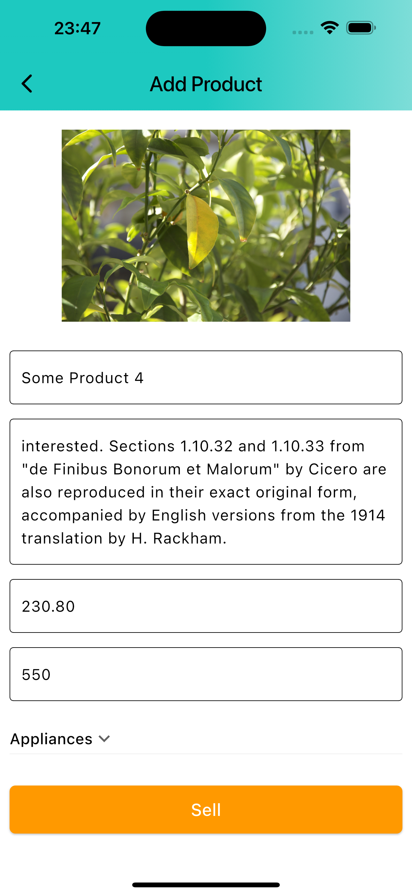

# Amazon Clone

Amazon clone have eaten my whole week of life.
I wrote my server on my own aka APIs.
The server have been write on nodejs.
[reference link](https://www.youtube.com/watch?v=O3nmP-lZAdg&list=PLlzmAWV2yTgCjoZNF3hLX3puYJir9vSQO&index=3)

## Table of Contents

- [Features](#features)
- [Screenshots](#screenshots)
- [Installation](#installation)
- [Packages used](#packages-used)

## Features

- Email & Password Authentication
- Persisting Auth State
- Searching Products
- Filtering Products (Based on Category)
- Product Details
- Rating
- Getting Deal of the Day
- Cart
- Checking out with Google/Apple Pay
- Viewing My Orders
- Viewing Order Details & Status
- Sign Out
- Admin Panel
- Viewing All Products
- Adding Products
- Deleting Products
- Viewing Orders
- Changing Order Status

## Screenshots

  
  
  

  
  
  

  
  
  

  
  
  

## Installation

After cloning this repository go to `amazon-clone` folder. Then, follow the following steps:

- Install nodejs
- Run it

## Packages used

- cupertino_icons
- http
- provider
- shared_preferences
- carousel_slider
- dotted_border
- file_picker
- cloudinary_public
- flutter_rating_bar
- pay
